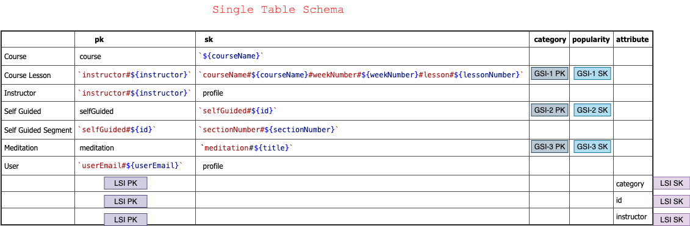

## Fabletics Fit Mimic

This app was intended to display the same UI and give some of the basic functionalities of the FIT app.

### Tech Stack

- [DynamoDB] - Database
- [AWS S3 Bucket] - photo / video storage
- [Node] - Node Package Manager
- [Apollo Server] - server instance for graphQl
- [GraphQL] - querying interface
- [React Native] - Library
- [React Navigation v5] - navigation
- [Typescript] - javascript more strictly typed
- [URQL] - client side graphql interface

### Notes on Completion & Funcionality

- All components, screens and navigation have been completed (with the exception of the component that is immidiately presented when a Self Guided Lesson is selected by a user, when selected in this app it takes the user directly to the video player).
- The Home Screen, after sign in, displays the lessons and meditations by their popularity (via watch count) as in the Fit App.
- Workouts separates lessons by category. (Lessons complete / Self Guided not completed)
- Upon completion of a video lesson, updates are made to user acheivement stats (userWatchTime, lessonsCompleted)
- Lesson popularity is updated by any of the following conditions: video is exited via mark completed, quit or video completion.
- Sign on is generic and is used only to provide a user token --this app will need to be developed further; to a point where it can be utilized for securing db requests, spotify or anything else that may require credentials.

### Context

- Context is utilized for giving the user an Auth token and email values @ the App state level.
- Context is utilized in Each of the video player state levels.

### useReducer

Reducers are used in accompaniment to context in order to manage state where I felt it was too complext to manage with useState hooks. this was especially true in the Self Guided and Lesson video players.

### DynamoDb Table Design



# Installation

Clone Repo

```sh
$ npm install
$ cd client
$ npm install
$ cd ..
```

- after install completes

- You will need to unSilence lines 9-14 in the server.js file and paste in your aws secret and ddb access keys into their respective values

```sh

$ npm run server
$ cd client
$ npm run start
$ npm run ios

```

### What I Learned

This was a really interesting project to work on. I liked using the tech stack:

- react-native is very similar to React, which I am used to working in but there are certainly some differences.
- I usually use a windows pc and migrated to a mac for this project
- I have never used Dynamo DB, Typescript, GraphWl, Urql or an apollo server before, but am really glad that I have now!

### Some struggles that I faced

- Reverse engineering an app came with some struggles

  - - creating a single table design that would work for this application
  - - missing something in the app flow, such as a detail or entire component had me back peddling once in a while
  - - learning while doing is always the best approach but in this case where there were multiple things being learned simultaneiously

- personl bio site can be found at:
  https://mattwellman.dev
